# StakeBasket Contracts

A comprehensive DeFi protocol for multi-asset staking and liquid staking on CoreDAO, featuring governance, tiered rewards, and automated yield optimization.

## 🌐 Live Deployment - Core Testnet2

**🧪 Complete System Deployed (2025-08-10)**

| Contract | Address | Purpose |
|----------|---------|---------|
| **StakeBasket** | [`0x13F8b7693445c180Ec11f211d9Af425920B795Af`](https://scan.test2.btcs.network/address/0x13F8b7693445c180Ec11f211d9Af425920B795Af) | Main ETF contract |
| **StakeBasketToken** | [`0x78B9B8e98d3df0F05cB0f7790524fB1432d430fD`](https://scan.test2.btcs.network/address/0x78B9B8e98d3df0F05cB0f7790524fB1432d430fD) | ETF share tokens |
| **BasketGovernance** | [`0x43e9E9f5DA3dF1e0E0659be7E321e9397E41aa8e`](https://scan.test2.btcs.network/address/0x43e9E9f5DA3dF1e0E0659be7E321e9397E41aa8e) | DAO governance |
| **BasketStaking** | [`0xC2072F6546Af5FfE732707De5Db2925C55a2975B`](https://scan.test2.btcs.network/address/0xC2072F6546Af5FfE732707De5Db2925C55a2975B) | Tiered staking rewards |
| **CoreLiquidStakingManager** | [`0x0925Df2ae2eC60f0abFF0e7E4dCA6f4B16351c0E`](https://scan.test2.btcs.network/address/0x0925Df2ae2eC60f0abFF0e7E4dCA6f4B16351c0E) | Liquid staking |
| **StCoreToken** | [`0x19640421A039E231312c2C0941D8b112e02876C5`](https://scan.test2.btcs.network/address/0x19640421A039E231312c2C0941D8b112e02876C5) | Liquid staking tokens |
| **DualStakingBasket** | [`0x0C9A264bA0c35e327ae0CdB4507F2D6142BD8a3f`](https://scan.test2.btcs.network/address/0x0C9A264bA0c35e327ae0CdB4507F2D6142BD8a3f) | Dual staking optimization |
| **StakingManager** | [`0x076A2418F51fc1eBd54e30030FD670709f8735B4`](https://scan.test2.btcs.network/address/0x076A2418F51fc1eBd54e30030FD670709f8735B4) | Validator management |
| **PriceFeed** | [`0x61C9A97fC6B790d09024676AFaC07e467cd4f74d`](https://scan.test2.btcs.network/address/0x61C9A97fC6B790d09024676AFaC07e467cd4f74d) | Price oracle |
| **UnbondingQueue** | [`0x0A4a6dB1718A515EA613873271b505BA5b1aB256`](https://scan.test2.btcs.network/address/0x0A4a6dB1718A515EA613873271b505BA5b1aB256) | Withdrawal queue |

**🧪 Test Tokens:**
- **MockCORE**: [`0xFb9c7Fb19351316B48eaD2c96E19880Cabc1BbC1`](https://scan.test2.btcs.network/address/0xFb9c7Fb19351316B48eaD2c96E19880Cabc1BbC1)
- **MockCoreBTC**: [`0xe9A0850ED0A4f51A0426CaB7079Cc10921A07096`](https://scan.test2.btcs.network/address/0xe9A0850ED0A4f51A0426CaB7079Cc10921A07096)
- **BasketToken**: [`0xA6ae2E223A8916314b841a92AfC338e72b9f74ED`](https://scan.test2.btcs.network/address/0xA6ae2E223A8916314b841a92AfC338e72b9f74ED)

**Network:** Core Testnet2 (Chain ID: 1114)  
**RPC:** `https://rpc.test2.btcs.network`  
**Explorer:** `https://scan.test2.btcs.network`

## 🏗️ Architecture Overview

### 📊 Visual System Architecture

```mermaid
graph TD
    User[👤 User] --> |"Deposits ETH + BTC"| DSB[🧠 DualStakingBasket]
    User --> |"Deposits Assets"| SB[🏦 StakeBasket]
    
    subgraph "Logic Layer"
        DSB --> |"Calculates shares<br/>Manages ratios<br/>Handles staking"| SBT[🎫 StakeBasketToken]
        SB --> |"Multi-asset ETF<br/>Rebalancing<br/>Fee management"| SBT
    end
    
    DSB --> |"Stakes CORE + BTC"| MDS[🎯 MockDualStaking]
    SB --> |"Delegates CORE"| MCS[⚡ MockCoreStaking]
    
    subgraph "External Protocols"
        MDS --> |"Tier bonuses<br/>8-20% APY"| Rewards[💰 Staking Rewards]
        MCS --> |"Validator rewards<br/>~8% APY"| Rewards
    end
    
    SBT --> |"cbETF tokens<br/>(ERC20)"| User
    Rewards --> |"Compound & distribute"| DSB
    Rewards --> |"Auto-compound"| SB
    
    style User fill:#e1f5fe
    style DSB fill:#f3e5f5
    style SB fill:#f3e5f5
    style SBT fill:#e8f5e8
    style MDS fill:#fff3e0
    style MCS fill:#fff3e0
    style Rewards fill:#fce4ec
```



### 🔄 Contract Interaction Flow


### 🎯 Why Two Contracts?

| Aspect | StakeBasketToken (Token) | DualStakingBasket (Logic) |
|--------|-------------------------|---------------------------|
| **Purpose** | Represents user shares | Handles all operations |
| **Functionality** | Mint/burn tokens only | Staking, rewards, calculations |
| **Complexity** | Simple ERC20 | Complex business logic |
| **Security** | Minimal attack surface | Protected by access controls |
| **Upgradability** | Stable token address | Logic can be upgraded |
| **User Interaction** | Users hold these tokens | Users call functions here |

### 🏛️ Complete System Architecture


### Core Governance & Management Layer

#### **BasketGovernance.sol**
- **Purpose**: Decentralized governance system for BASKET token holders
- **Key Features**:
  - Proposal submission, voting, and execution
  - Tiered voting power based on staking status
  - Support for CoreDAO governance delegation
  - 3-day voting period with 1-day execution delay
- **Integrations**: BasketStaking (voting multipliers), CoreDAOGovernanceProxy

#### **BasketStaking.sol**
- **Purpose**: Tiered staking rewards system for BASKET tokens
- **Key Features**:
  - 4 tiers: Bronze (100), Silver (1K), Gold (10K), Platinum (100K) BASKET
  - Fee reductions: 5% → 50% based on tier
  - Voting power multipliers: 1x → 1.5x
  - Protocol fee distribution as ETH rewards
- **Integrations**: BasketGovernance (voting power), StakeBasket (fee discounts)

### Liquid Staking Infrastructure

#### **CoreLiquidStakingManager.sol**
- **Purpose**: Main liquid staking protocol for CORE tokens
- **Key Features**:
  - Stake CORE → receive stCORE (liquid staking token)
  - Automated validator selection and rebalancing
  - Daily reward collection and compounding
  - 7-day unstaking period with queue management
- **Integrations**: StCoreToken, MockCoreStaking, UnbondingQueue

#### **StCoreToken.sol**
- **Purpose**: ERC20 liquid staking token representing staked CORE
- **Key Features**:
  - Dynamic conversion rate (CORE ↔ stCORE)
  - Reward compounding increases conversion rate
  - Only mintable by CoreLiquidStakingManager
- **Integrations**: CoreLiquidStakingManager (exclusive minting)

### Multi-Asset ETF Layer

#### **StakeBasket.sol**
- **Purpose**: Multi-asset staking ETF for CORE + lstBTC
- **Key Features**:
  - Diversified exposure with automatic rebalancing
  - NAV-based share pricing with real-time calculations
  - Tiered fee discounts for BASKET stakers
  - Management (0.5%) and performance (10%) fees
- **Integrations**: StakeBasketToken, StakingManager, PriceFeed, BasketStaking

#### **StakeBasketToken.sol**
- **Purpose**: ERC20 token representing shares in StakeBasket ETF
- **Key Features**:
  - Mintable/burnable only by StakeBasket contract
  - Represents proportional ownership of underlying assets
- **Integrations**: StakeBasket (exclusive minting)

#### **DualStakingBasket.sol**
- **Purpose**: Specialized strategy for CoreDAO dual staking optimization
- **Key Features**:
  - Maintains optimal CORE:BTC ratios for maximum yield
  - 4 tiers: BASE (0:1), BOOST (2000:1), SUPER (6000:1), SATOSHI (16000:1)
  - Automatic DEX rebalancing with slippage protection
  - Targets highest yield tier (Satoshi)
- **Integrations**: StakeBasketToken, PriceFeed, DEX routers

### Supporting Infrastructure

#### **StakingManager.sol**
- **Purpose**: External staking coordinator and validator management
- **Key Features**:
  - CORE validator delegation and reward claiming
  - lstBTC minting/redemption coordination
  - Automated validator rebalancing based on APY/risk scores
  - Optimal validator distribution algorithms
- **Integrations**: StakeBasket, MockCoreStaking, PriceFeed

#### **PriceFeed.sol**
- **Purpose**: Oracle integration for asset pricing
- **Key Features**:
  - Chainlink-compatible price feeds for CORE, BTC, lstBTC
  - Circuit breaker protection (10% deviation threshold)
  - Manual price updates for testing environments
  - 1-hour staleness protection
- **Integrations**: All contracts requiring pricing (StakeBasket, DualStakingBasket)

#### **UnbondingQueue.sol**
- **Purpose**: Withdrawal queue management system
- **Key Features**:
  - Manages unbonding periods (7 days CORE, 1 day lstBTC)
  - Instant withdrawal for amounts < 100K tokens
  - Queue position tracking and wait time estimates
  - Liquidity pool for instant withdrawals
- **Integrations**: CoreLiquidStakingManager, StakeBasket

#### **CoreDAOGovernanceProxy.sol**
- **Purpose**: Bridge for BASKET holders to participate in CoreDAO governance
- **Key Features**:
  - Aggregates BASKET holder votes for CoreDAO proposals
  - Validator and hash power delegation proposals
  - Snapshot governance integration
  - Automated vote execution on CoreDAO network
- **Integrations**: BasketGovernance, MockCoreStaking

### Testing & Mock Contracts

#### **MockCoreStaking.sol**
- **Purpose**: Mock implementation of CoreDAO staking for testing
- **Key Features**:
  - Simulates validator delegation with configurable parameters
  - Risk scoring and performance metrics
  - Reward calculation with commission and hybrid scores
  - Support for validator status changes (active/jailed)

#### **MockDualStaking.sol, MockLstBTC.sol, MockTokens.sol**
- **Purpose**: Testing infrastructure for various DeFi primitives

## 🔄 Integration Flow

### 1. Governance → Staking Integration
```
User BASKET → BasketStaking → Tier Benefits
                    ↓
         BasketGovernance ← Voting Power Multiplier
```

### 2. ETF Ecosystem
```
User Assets → StakeBasket → StakingManager → External Protocols
     ↓              ↓              ↓
ETF Shares ← NAV Calculation ← Price Feeds
     ↓
Fee Discounts ← BasketStaking Tier
```

### 3. Liquid Staking Flow
```
User CORE → CoreLiquidStakingManager → Validator Delegation
    ↓                    ↓                      ↓
stCORE ← Dynamic Rate ← Reward Collection ← Staking Rewards
```

### 4. Dual Staking Optimization
```
CORE + BTC → DualStakingBasket → Ratio Analysis → DEX Rebalancing
     ↓                ↓                ↓              ↓
Target Tier ← Current Ratio ← Price Feeds ← Optimal Yield
```

## 📊 Key Metrics & Parameters

### Governance
- **Proposal Threshold**: 100 BASKET tokens
- **Voting Period**: 3 days
- **Execution Delay**: 1 day  
- **Quorum**: 10% of total supply
- **Majority**: 51% of votes cast

### Staking Tiers
- **Bronze**: 100 BASKET (5% fee reduction, 1x voting)
- **Silver**: 1,000 BASKET (10% fee reduction, 1.1x voting)
- **Gold**: 10,000 BASKET (25% fee reduction, 1.25x voting)
- **Platinum**: 100,000 BASKET (50% fee reduction, 1.5x voting)

### Fees
- **Management Fee**: 0.5% annually
- **Performance Fee**: 10% of excess returns
- **Protocol Fee Share**: 20% of total fees
- **Unstaking Period**: 7 days (CORE), 1 day (lstBTC)

### Risk Parameters
- **Max Validator Risk Score**: 600/1000
- **Rebalance Threshold**: 5% deviation
- **Price Staleness**: 1 hour maximum
- **Circuit Breaker**: 10% price deviation

## 🚀 Deployment Flow

1. **Core Infrastructure**
   ```
   MockTokens → PriceFeed → UnbondingQueue
   ```

2. **Governance Layer**
   ```
   StakeBasketToken → BasketStaking → BasketGovernance
   ```

3. **Liquid Staking**
   ```
   StCoreToken → MockCoreStaking → CoreLiquidStakingManager
   ```

4. **ETF Layer**
   ```
   StakingManager → StakeBasket → DualStakingBasket
   ```

5. **Governance Bridge**
   ```
   CoreDAOGovernanceProxy (connects to BasketGovernance)
   ```

## 🔐 Security Features

- **ReentrancyGuard**: All state-changing functions protected
- **Ownable**: Administrative functions restricted
- **Pausable**: Emergency pause functionality
- **Circuit Breakers**: Price deviation protection
- **Timelock**: Governance execution delays
- **Multi-signature**: Recommended for ownership

## 🧪 Testing

The protocol includes comprehensive mock contracts for testing:
- **MockCoreStaking**: CoreDAO staking simulation
- **MockDualStaking**: Dual staking mechanism testing  
- **MockLstBTC**: Liquid BTC staking simulation
- **MockTokens**: ERC20 token implementations

## 📈 Yield Sources

1. **CORE Staking**: ~8% APY from validator rewards
2. **lstBTC Yield**: Bitcoin staking rewards
3. **Dual Staking Bonuses**: Up to 50% bonus for optimal ratios
4. **Fee Optimization**: Tiered fee reductions
5. **Automated Rebalancing**: Continuous yield optimization

---

*This protocol represents a comprehensive DeFi ecosystem combining governance, liquid staking, and automated yield optimization strategies on CoreDAO.*