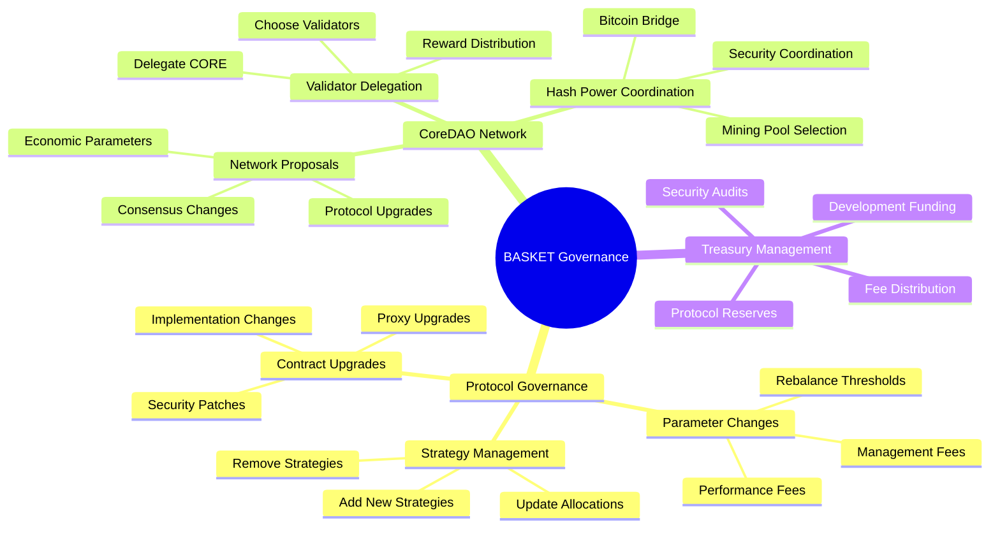

# StakeBasket Contracts

A comprehensive DeFi protocol for multi-asset staking and liquid staking on CoreDAO, featuring governance, tiered rewards, and automated yield optimization.

## 🌐 Live Deployment - Core Testnet2

**📋 Complete System Deployed** - See [deployment config](../deployment-data/testnet2-deployment.json) for all contract addresses

**Network:** Core Testnet2 (Chain ID: 1114)  
**RPC:** `https://rpc.test2.btcs.network`  
**Explorer:** `https://scan.test2.btcs.network`

## 🏗️ Architecture Overview

### 📊 Visual System Architecture


### 🔄 Contract Interaction Flow

```mermaid
sequenceDiagram
    participant User as 👤 User
    participant DSB as 🧠 DualStakingBasket
    participant SBT as 🎫 StakeBasketToken
    participant MDS as 🎯 MockDualStaking
    participant PF as 📊 PriceFeed
    
    Note over User, PF: Deposit Flow (50 ETH + 1 BTC)
    
    User->>DSB: depositNativeCORE(1 BTC) + 50 ETH
    DSB->>PF: getPrice("BTC/USD", "ETH/USD")
    PF-->>DSB: $50,000, $2,000
    
    Note over DSB: Calculate optimal ratio (50:1)
    Note over DSB: Determine share value = $100,000
    
    DSB->>MDS: stakeDual(1 BTC) + 50 ETH
    MDS-->>DSB: Success, Tier SUPER activated
    
    DSB->>SBT: mint(user, 75 cbETF)
    SBT-->>User: 75 cbETF tokens
    
    Note over User, PF: Reward Flow (Daily)
    
    MDS->>DSB: Daily rewards (tier bonus applied)
    DSB->>SBT: updateTotalSupply() for NAV
    
    Note over User, PF: Withdrawal Flow
    
    User->>DSB: requestWithdraw(10 cbETF)
    DSB->>SBT: burn(user, 10 cbETF)
    DSB->>MDS: unstakeDual(proportional amounts)
    DSB-->>User: ETH + BTC returned
```



### 🎯 Why Two Contracts?

| Aspect | StakeBasketToken (Token) | DualStakingBasket (Logic) |
|--------|-------------------------|---------------------------|
| **Purpose** | Represents user shares | Handles all operations |
| **Functionality** | Mint/burn tokens only | Staking, rewards, calculations |
| **Complexity** | Simple ERC20 | Complex business logic |
| **Security** | Minimal attack surface | Protected by access controls |
| **Upgradability** | Stable token address | Logic can be upgraded |
| **User Interaction** | Users hold these tokens | Users call functions here |

### 🏛️ Complete System Architecture

```mermaid
graph TB
    subgraph "👤 User Layer"
        User[User Wallet]
        cbETF[cbETF Tokens]
        User -.->|holds| cbETF
    end
    
    subgraph "🎫 Token Layer"
        SBT[StakeBasketToken<br/>📝 ERC20 Contract]
        SBT -.->|mints/burns| cbETF
    end
    
    subgraph "🧠 Logic Layer"
        DSB[DualStakingBasket<br/>🏦 Main Logic]
        SB[StakeBasket<br/>📊 ETF Strategy]
        SM[StakingManager<br/>⚡ Coordinator]
        BS[BasketStaking<br/>🎯 Governance]
        
        DSB -->|controls| SBT
        SB -->|controls| SBT
        DSB -.->|uses| SM
        SB -.->|uses| SM
        BS -.->|provides discounts| DSB
    end
    
    subgraph "📊 Infrastructure Layer"
        PF[PriceFeed<br/>💰 Oracle]
        UQ[UnbondingQueue<br/>⏰ Withdrawals]
        
        DSB -->|reads prices| PF
        SB -->|reads prices| PF
        DSB -->|manages queue| UQ
        SB -->|manages queue| UQ
    end
    
    subgraph "🎯 External Protocols"
        MDS[MockDualStaking<br/>🚀 CoreDAO Dual]
        MCS[MockCoreStaking<br/>⚡ Validators]
        
        DSB -->|stakes assets| MDS
        SM -->|delegates| MCS
        MDS -.->|rewards| DSB
        MCS -.->|rewards| SM
    end
    
    subgraph "🏛️ Governance Layer"
        BG[BasketGovernance<br/>🗳️ DAO Voting]
        CGP[CoreDAOGovernance<br/>🌐 Proxy]
        
        BS -->|voting power| BG
        BG -->|proposals| CGP
    end
    
    User -->|deposits| DSB
    User -->|deposits| SB
    User -->|stakes BASKET| BS
    User -->|votes| BG
    
    style User fill:#e1f5fe
    style cbETF fill:#e8f5e8
    style SBT fill:#e8f5e8
    style DSB fill:#f3e5f5
    style SB fill:#f3e5f5
    style MDS fill:#fff3e0
    style MCS fill:#fff3e0
    style PF fill:#f1f8e9
    style BG fill:#fce4ec
```



## 🏛️ Governance System Architecture

### 📊 Complete Governance Flow

```mermaid
graph TB
    subgraph "👥 Community Layer"
        Users[BASKET Token Holders]
        Stakers[BASKET Stakers]
        Committee[Governance Committee]
        
        Users -.->|holds tokens| Stakers
        Stakers -.->|enhanced voting power| Committee
    end
    
    subgraph "🗳️ Governance Layer"
        BG[BasketGovernance<br/>📋 Main DAO]
        CGP[CoreDAOGovernanceProxy<br/>🌐 Network Bridge]
        BS[BasketStaking<br/>💎 Voting Power]
        
        BG <-->|manages proposals| CGP
        BS -->|calculates voting power| BG
        BS -->|provides tier benefits| CGP
    end
    
    subgraph "🎯 Execution Layer"
        SB[StakeBasket<br/>📊 Protocol]
        DSB[DualStakingBasket<br/>🏦 Strategy]
        SM[StakingManager<br/>⚡ Validator]
        
        BG -->|executes decisions| SB
        BG -->|updates parameters| DSB
        CGP -->|delegates validators| SM
    end
    
    subgraph "🌐 External Networks"
        CoreDAO[CoreDAO Network<br/>⚡ Blockchain]
        Validators[Validators<br/>🛡️ Network Security]
        Mining[Bitcoin Mining<br/>⛏️ Hash Power]
        
        CGP -->|votes on proposals| CoreDAO
        CGP -->|delegates CORE| Validators
        CGP -->|coordinates mining| Mining
    end
    
    Users -->|votes| BG
    Users -->|creates proposals| CGP
    Committee -->|multi-sig approval| CGP
    BG -->|triggers execution| CGP
    
    style Users fill:#e1f5fe
    style BG fill:#f3e5f5
    style CGP fill:#fff3e0
    style CoreDAO fill:#e8f5e8
    style Committee fill:#fce4ec
```



### 🔄 Governance Interaction Flows

#### 1. BASKET Protocol Governance Flow

```mermaid
sequenceDiagram
    participant User as 👤 BASKET Holder
    participant BS as 💎 BasketStaking
    participant BG as 📋 BasketGovernance
    participant SB as 📊 StakeBasket
    
    Note over User, SB: Proposal Creation & Voting
    
    User->>BG: createProposal("Increase management fee", calldata)
    BG->>BG: Validate proposal threshold (100 BASKET)
    BG-->>User: Proposal ID created
    
    Note over User, SB: Voting Phase (3 days)
    
    User->>BS: Stake BASKET tokens for voting power
    BS->>BG: updateVotingPower(user, tier_multiplier)
    User->>BG: vote(proposalId, support, reason)
    
    Note over User, SB: Execution Phase
    
    BG->>BG: checkQuorum() & calculateResult()
    BG->>SB: executeProposal(calldata)
    SB-->>BG: Execution result
    BG->>User: Proposal executed ✅
```



#### 2. CoreDAO Network Governance Flow

```mermaid
sequenceDiagram
    participant User as 👤 BASKET Holder
    participant CGP as 🌐 CoreDAOGovernanceProxy
    participant BG as 📋 BasketGovernance
    participant CoreDAO as ⚡ CoreDAO Network
    participant Committee as 👥 Gov Committee
    
    Note over User, Committee: CoreDAO Proposal Flow
    
    User->>CGP: createCoreDAOProposal("Increase block gas limit", snapshotId)
    CGP->>BG: propose() [Creates linked BASKET proposal]
    BG-->>User: Basket proposal created
    
    Note over User, Committee: Voting & Aggregation
    
    User->>BG: vote(basketProposalId, support)
    Note over BG: 3-day voting period
    BG->>CGP: executeCoreDAOVote(proxyProposalId)
    
    Note over User, Committee: Security & Execution
    
    CGP->>CGP: verifyQuorum() & aggregateVotes()
    Committee->>CGP: approveGovernanceAction(actionHash)
    CGP->>CoreDAO: submitCommunityVote(aggregatedVote)
    CoreDAO-->>CGP: Vote recorded on CoreDAO ✅
```



#### 3. Validator Delegation Flow

```mermaid
sequenceDiagram
    participant User as 👤 BASKET Holder
    participant CGP as 🌐 CoreDAOGovernanceProxy
    participant BG as 📋 BasketGovernance
    participant SM as ⚡ StakingManager
    participant Validator as 🛡️ CoreDAO Validator
    participant Committee as 👥 Committee
    
    Note over User, Committee: Validator Selection Process
    
    User->>CGP: createValidatorDelegation(validatorAddr, 1000 CORE)
    CGP->>CGP: checkDelegationLimits() & validateValidator()
    CGP->>BG: propose("Delegate to Validator X")
    
    Note over User, Committee: Community Voting
    
    User->>BG: vote(basketProposalId, FOR)
    Note over BG: 3-day voting + super-majority check
    BG->>CGP: executeValidatorDelegation(delegationId)
    
    Note over User, Committee: Delegation Execution
    
    Committee->>CGP: approveGovernanceAction(actionHash)
    CGP->>SM: undelegate(oldValidator, amount)
    CGP->>SM: delegate(newValidator, amount)
    SM->>Validator: Delegate 1000 CORE
    Validator-->>SM: Delegation confirmed ✅
```



### 🎛️ Governance Security Model

```mermaid
graph TB
    subgraph "🔐 Security Layers"
        TL[⏰ Timelock<br/>24h Normal / 6h Emergency]
        MS[✋ Multi-Signature<br/>2+ Committee Approvals]
        EP[🚨 Emergency Pause<br/>Circuit Breaker]
        BL[🚫 Blacklist<br/>Malicious Validators]
    end
    
    subgraph "📊 Risk Controls"
        QR[📈 Quorum Requirements<br/>10% Minimum Participation]
        SM[🗳️ Super Majority<br/>67% for Large Changes]
        DL[⚖️ Delegation Limits<br/>Max 30% per Validator]
        VV[✅ Vote Verification<br/>BASKET Token Weighted]
    end
    
    subgraph "👥 Access Control"
        OW[👑 Owner<br/>Full Admin Rights]
        CM[🏛️ Committee<br/>Multi-sig Governance]
        OP[⚡ Operators<br/>Limited Permissions]
        EM[🚨 Emergency<br/>Pause Authority]
    end
    
    TL --> MS
    MS --> EP
    EP --> BL
    
    QR --> SM
    SM --> DL
    DL --> VV
    
    OW --> CM
    CM --> OP
    OP --> EM
    
    style TL fill:#f8d7da
    style MS fill:#d4edda
    style EP fill:#fff3cd
    style QR fill:#cce5ff
```



### 🎯 Governance Types & Powers



### 📈 Voting Power Calculation

```mermaid
graph LR
    subgraph "💎 BASKET Staking Tiers"
        Bronze[Bronze Tier<br/>100 BASKET<br/>1.0x Voting Power]
        Silver[Silver Tier<br/>1,000 BASKET<br/>1.1x Voting Power]
        Gold[Gold Tier<br/>10,000 BASKET<br/>1.25x Voting Power]
        Platinum[Platinum Tier<br/>100,000 BASKET<br/>1.5x Voting Power]
    end
    
    subgraph "🗳️ Final Voting Power"
        Formula[Base BASKET × Tier Multiplier × Time Weight]
        
        Bronze --> Formula
        Silver --> Formula
        Gold --> Formula
        Platinum --> Formula
    end
    
    subgraph "🎯 Governance Benefits"
        VotingPower[Enhanced Voting Power]
        FeeReduction[Protocol Fee Discounts]
        ProposalThreshold[Lower Proposal Thresholds]
        
        Formula --> VotingPower
        Formula --> FeeReduction
        Formula --> ProposalThreshold
    end
    
    style Bronze fill:#cd7f32
    style Silver fill:#c0c0c0
    style Gold fill:#ffd700
    style Platinum fill:#e5e4e2
    style Formula fill:#e1f5fe
```



## 📁 Organized Contract Structure

This contracts directory is now organized into logical categories for better maintainability:

```
contracts/
├── core/                          # Core protocol contracts
│   ├── staking/                   # Main staking logic (7 files)
│   │   ├── DualStakingBasket.sol     # CoreDAO dual staking optimization
│   │   ├── StakeBasket.sol           # Multi-asset staking ETF
│   │   ├── BasketStaking.sol         # Tiered staking rewards
│   │   ├── StakingManager.sol        # Validator management
│   │   ├── CoreLiquidStakingManager.sol # CORE liquid staking
│   │   ├── UnbondingQueue.sol        # Withdrawal queue management
│   │   └── SatoshiTierBasket.sol     # Specialized tier basket
│   ├── tokens/                    # Token contracts (4 files)
│   │   ├── StakeBasketToken.sol      # ETF share tokens
│   │   ├── StCoreToken.sol           # Liquid CORE tokens
│   │   ├── CoreDAOLiquidBTC.sol      # Liquid BTC implementation
│   │   └── SimpleToken.sol           # Basic ERC20 implementation
│   └── governance/               # Governance systems (2 files)
│       ├── BasketGovernance.sol      # Main DAO governance
│       └── CoreDAOGovernanceProxy.sol # Network bridge
├── integrations/                  # External integrations
│   └── oracles/                  # Price feed contracts (3 files)
│       ├── PriceFeed.sol            # Main oracle integration
│       ├── CoreOracle.sol           # Core-specific oracle
│       └── API3PriceFeed.sol        # API3 integration
├── interfaces/                    # Contract interfaces (5 files)
├── security/                      # Security modules (2 files)
├── testing/                      # Test infrastructure
│   ├── mocks/                    # Mock contracts (8 files)
│   └── helpers/                  # Test helpers (2 files)
└── utils/                        # Utility contracts
    ├── deployment/               # Deployment scripts (1 file)
    ├── factory/                  # Factory contracts (1 file)
    └── configuration/            # Config contracts (2 files)
```

### Core Protocol Layer

#### **core/staking/ - Main Staking Logic**

**DualStakingBasket.sol**
- **Purpose**: Specialized strategy for CoreDAO dual staking optimization
- **Key Features**:
  - Maintains optimal CORE:BTC ratios for maximum yield
  - 4 tiers: BASE (0:1), BOOST (2000:1), SUPER (6000:1), SATOSHI (16000:1)
  - Automatic DEX rebalancing with slippage protection
  - Targets highest yield tier (Satoshi)
- **Integrations**: StakeBasketToken, PriceFeed, DEX routers

**BasketStaking.sol**
- **Purpose**: Tiered staking rewards system for BASKET tokens
- **Key Features**:
  - 4 tiers: Bronze (100), Silver (1K), Gold (10K), Platinum (100K) BASKET
  - Fee reductions: 5% → 50% based on tier
  - Voting power multipliers: 1x → 1.5x
  - Protocol fee distribution as ETH rewards
- **Integrations**: BasketGovernance (voting power), StakeBasket (fee discounts)

#### **core/governance/ - Governance Systems**

**BasketGovernance.sol**
- **Purpose**: Decentralized governance system for BASKET token holders
- **Key Features**:
  - Proposal submission, voting, and execution
  - Tiered voting power based on staking status
  - Support for CoreDAO governance delegation
  - 3-day voting period with 1-day execution delay
- **Integrations**: BasketStaking (voting multipliers), CoreDAOGovernanceProxy

#### **core/tokens/ - Token Infrastructure**

**StakeBasketToken.sol**
- **Purpose**: ERC20 token representing shares in StakeBasket ETF
- **Key Features**:
  - Mintable/burnable only by StakeBasket contract
  - Represents proportional ownership of underlying assets
- **Integrations**: StakeBasket (exclusive minting)

### Liquid Staking Infrastructure

#### **CoreLiquidStakingManager.sol**
- **Purpose**: Main liquid staking protocol for CORE tokens
- **Key Features**:
  - Stake CORE → receive stCORE (liquid staking token)
  - Automated validator selection and rebalancing
  - Daily reward collection and compounding
  - 7-day unstaking period with queue management
- **Integrations**: StCoreToken, MockCoreStaking, UnbondingQueue

#### **StCoreToken.sol**
- **Purpose**: ERC20 liquid staking token representing staked CORE
- **Key Features**:
  - Dynamic conversion rate (CORE ↔ stCORE)
  - Reward compounding increases conversion rate
  - Only mintable by CoreLiquidStakingManager
- **Integrations**: CoreLiquidStakingManager (exclusive minting)

### Multi-Asset ETF Layer

#### **StakeBasket.sol**
- **Purpose**: Multi-asset staking ETF for CORE + lstBTC
- **Key Features**:
  - Diversified exposure with automatic rebalancing
  - NAV-based share pricing with real-time calculations
  - Tiered fee discounts for BASKET stakers
  - Management (0.5%) and performance (10%) fees
- **Integrations**: StakeBasketToken, StakingManager, PriceFeed, BasketStaking

#### **StakeBasketToken.sol**
- **Purpose**: ERC20 token representing shares in StakeBasket ETF
- **Key Features**:
  - Mintable/burnable only by StakeBasket contract
  - Represents proportional ownership of underlying assets
- **Integrations**: StakeBasket (exclusive minting)

#### **DualStakingBasket.sol**
- **Purpose**: Specialized strategy for CoreDAO dual staking optimization
- **Key Features**:
  - Maintains optimal CORE:BTC ratios for maximum yield
  - 4 tiers: BASE (0:1), BOOST (2000:1), SUPER (6000:1), SATOSHI (16000:1)
  - Automatic DEX rebalancing with slippage protection
  - Targets highest yield tier (Satoshi)
- **Integrations**: StakeBasketToken, PriceFeed, DEX routers

### Supporting Infrastructure

#### **StakingManager.sol**
- **Purpose**: External staking coordinator and validator management
- **Key Features**:
  - CORE validator delegation and reward claiming
  - lstBTC minting/redemption coordination
  - Automated validator rebalancing based on APY/risk scores
  - Optimal validator distribution algorithms
- **Integrations**: StakeBasket, MockCoreStaking, PriceFeed

#### **PriceFeed.sol**
- **Purpose**: Oracle integration for asset pricing
- **Key Features**:
  - Chainlink-compatible price feeds for CORE, BTC, lstBTC
  - Circuit breaker protection (10% deviation threshold)
  - Manual price updates for testing environments
  - 1-hour staleness protection
- **Integrations**: All contracts requiring pricing (StakeBasket, DualStakingBasket)

#### **UnbondingQueue.sol**
- **Purpose**: Withdrawal queue management system
- **Key Features**:
  - Manages unbonding periods (7 days CORE, 1 day lstBTC)
  - Instant withdrawal for amounts < 100K tokens
  - Queue position tracking and wait time estimates
  - Liquidity pool for instant withdrawals
- **Integrations**: CoreLiquidStakingManager, StakeBasket

#### **CoreDAOGovernanceProxy.sol**
- **Purpose**: Bridge for BASKET holders to participate in CoreDAO governance
- **Key Features**:
  - Aggregates BASKET holder votes for CoreDAO proposals
  - Validator and hash power delegation proposals
  - Snapshot governance integration
  - Automated vote execution on CoreDAO network
- **Integrations**: BasketGovernance, MockCoreStaking

### Testing & Mock Contracts

#### **MockCoreStaking.sol**
- **Purpose**: Mock implementation of CoreDAO staking for testing
- **Key Features**:
  - Simulates validator delegation with configurable parameters
  - Risk scoring and performance metrics
  - Reward calculation with commission and hybrid scores
  - Support for validator status changes (active/jailed)

#### **MockDualStaking.sol, MockLstBTC.sol, MockTokens.sol**
- **Purpose**: Testing infrastructure for various DeFi primitives

## 🔄 Integration Flow

### 1. Governance → Staking Integration
```
User BASKET → BasketStaking → Tier Benefits
                    ↓
         BasketGovernance ← Voting Power Multiplier
```

### 2. ETF Ecosystem
```
User Assets → StakeBasket → StakingManager → External Protocols
     ↓              ↓              ↓
ETF Shares ← NAV Calculation ← Price Feeds
     ↓
Fee Discounts ← BasketStaking Tier
```

### 3. Liquid Staking Flow
```
User CORE → CoreLiquidStakingManager → Validator Delegation
    ↓                    ↓                      ↓
stCORE ← Dynamic Rate ← Reward Collection ← Staking Rewards
```

### 4. Dual Staking Optimization
```
CORE + BTC → DualStakingBasket → Ratio Analysis → DEX Rebalancing
     ↓                ↓                ↓              ↓
Target Tier ← Current Ratio ← Price Feeds ← Optimal Yield
```

## 📊 Key Metrics & Parameters

### Governance
- **Proposal Threshold**: 100 BASKET tokens
- **Voting Period**: 3 days
- **Execution Delay**: 1 day  
- **Quorum**: 10% of total supply
- **Majority**: 51% of votes cast

### Staking Tiers
- **Bronze**: 100 BASKET (5% fee reduction, 1x voting)
- **Silver**: 1,000 BASKET (10% fee reduction, 1.1x voting)
- **Gold**: 10,000 BASKET (25% fee reduction, 1.25x voting)
- **Platinum**: 100,000 BASKET (50% fee reduction, 1.5x voting)

### Fees
- **Management Fee**: 0.5% annually
- **Performance Fee**: 10% of excess returns
- **Protocol Fee Share**: 20% of total fees
- **Unstaking Period**: 7 days (CORE), 1 day (lstBTC)

### Risk Parameters
- **Max Validator Risk Score**: 600/1000
- **Rebalance Threshold**: 5% deviation
- **Price Staleness**: 1 hour maximum
- **Circuit Breaker**: 10% price deviation

## 🚀 Deployment & Configuration

### 📁 Organized Deployment Files

All deployment configurations and contract addresses are organized in `/deployment-data/`:

```
deployment-data/
├── 🏠 LOCAL DEPLOYMENTS
│   ├── local-deployment.json              # ← YOUR ANVIL DEPLOYMENT (reusable!)
│   └── local-governance-deployment.json   # Governance contracts
│
├── 🌐 TESTNET DEPLOYMENTS  
│   ├── testnet2-deployment.json          # Main testnet deployment
│   ├── testnet2-frontend-config.json     # Frontend configuration
│   └── oracle-deployment.json            # Oracle-specific deployment
│
├── 🚀 PRODUCTION
│   ├── final-deployment.json             # Final production deployment
│   └── production-deployment.json        # Production configuration
│
└── ⚙️ CONFIGURATION
    ├── contract-deployment-config.json   # Contract deployment settings
    └── final-deployment.json             # Final deployment record
```

### 🔥 Quick Local Development

**Reuse Your Anvil Deployment:**
```bash
# 1. Start Anvil (same accounts as before)
npm run node:start

# 2. Your contracts are ready at these addresses:
# StakeBasket: 0xf5059a5D33d5853360D16C683c16e67980206f36
# MockCORE: 0x610178dA211FEF7D417bC0e6FeD39F05609AD788  
# PriceFeed: 0xB7f8BC63BbcaD18155201308C8f3540b07f84F5e

# 3. Test immediately (no redeployment needed!)
npm run test:verify
npm run test:integration:dual
```

**💡 Pro Tip:** The `local-deployment.json` will work as long as you use the same Anvil seed/mnemonic. If addresses change, just run `npm run deploy:local` to redeploy and update the file.

### 📋 Standard Deployment Flow

1. **Core Infrastructure**
   ```
   MockTokens → PriceFeed → UnbondingQueue
   ```

2. **Governance Layer**
   ```
   StakeBasketToken → BasketStaking → BasketGovernance
   ```

3. **Liquid Staking**
   ```
   StCoreToken → MockCoreStaking → CoreLiquidStakingManager
   ```

4. **ETF Layer**
   ```
   StakingManager → StakeBasket → DualStakingBasket
   ```

5. **Governance Bridge**
   ```
   CoreDAOGovernanceProxy (connects to BasketGovernance)
   ```

## 🔐 Security Features

- **ReentrancyGuard**: All state-changing functions protected
- **Ownable**: Administrative functions restricted
- **Pausable**: Emergency pause functionality
- **Circuit Breakers**: Price deviation protection
- **Timelock**: Governance execution delays
- **Multi-signature**: Recommended for ownership

## 🧪 Testing

The protocol includes comprehensive mock contracts for testing:
- **MockCoreStaking**: CoreDAO staking simulation
- **MockDualStaking**: Dual staking mechanism testing  
- **MockLstBTC**: Liquid BTC staking simulation
- **MockTokens**: ERC20 token implementations

## 📈 Yield Sources

1. **CORE Staking**: ~8% APY from validator rewards
2. **lstBTC Yield**: Bitcoin staking rewards
3. **Dual Staking Bonuses**: Up to 50% bonus for optimal ratios
4. **Fee Optimization**: Tiered fee reductions
5. **Automated Rebalancing**: Continuous yield optimization

---

*This protocol represents a comprehensive DeFi ecosystem combining governance, liquid staking, and automated yield optimization strategies on CoreDAO.*